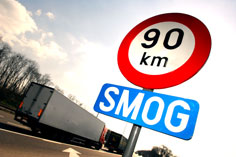

Pour certains rouler en voiture c'est mal, ça pue, c'est pas libre et ça coute chère. Durant mon dernier voyage à Paris, en voiture, j'ai pu le constater à travers différents exemples :

**#1)** Alors qu'en Belgique à cause d'une pollution excessive de l'air, la vitesse est limitée à 90 km/heure sur autoroutes, il suffit de franchir la frontière belgo-française pour remarquer qu'aucune limitation n'est pratiquée en France. Est-ce à dire que la pollution de l'air s'arrête à la frontière comme jadis [le nuage radioactif fut arrêté en France](http://www.ina.fr/archivespourtous/index.php?vue=notice&id_notice=CAB86010759 "Comment la France a détecté son nuage radioactif") ?

**#2)** Durant cette limitation de la vitesse j'ai remarqué 2 types de comportement au volant. Celui du bon père de famille qui effectivement respecte la limitation. On retrouve dans cette catégorie les camionneurs, je suppose que le disque de conduite qui enregistre les faits et gestes du camion, obligatoire en Europe y est pour quelque chose et les "vrais" père de famille, c'est-à-dire, ceux qui ont vraiment des enfants dans leur voitures et qui se sont vu demander plus d'une fois par ceux-ci durant le trajet ... _"pourquoi y'a écrit **smog** en dessous du panneau Papa ?"_ . Dans l'autre catégorie  il y a tout les autres, la majorité hélas, qui se foutent royalement de la limitation et qui table sur une absence de contrôle...

**#3)** Le meilleur je l'ai quand même trouvé dans le show-room de Citroën sur les Champs Elysée avec la **GTbyCITROËN**, le concept car que l'on retrouve dans [GranTurismo V](http://www.granturismoworld.com/ "le site officiel de Granturismo, au cas où tu ne le connaitrais pas déjà") :

D'après cette pancarte, et si j'ai bien tout compris, le monde virtuel est sauvé... [A quand la sauvegarde du monde réel](http://www.automoto.fr/auto-moto/video/concept-citroen-gt-essai-automoto-07-12-2008-4183828.html "Essai réel sur un circuit réel de la GTByCITROEN") ??
