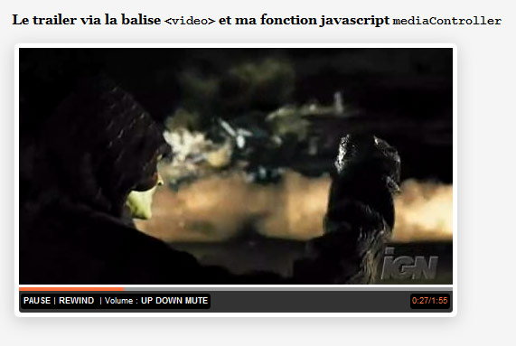

Firefox 3.1 est en béta et bien que je déteste les [beta-software](http://nyams.planbweb.com/blog/2008/04/22/yen-a-marre-des-beta/ "J'aime pas les softs en beta"), je me suis amusé à trifouiller dans les entrailles de la bête, à l'initiative de [John Resig](http://ejohn.org/blog/a-web-developers-responsibility/ "Pourquoi John Resig est pour que l'on teste les navigateurs en béta"). Et voici comment, en 3 heures, je me suis retrouvé à coder une fonction pour la gestion de la balise `video` pour Firefox 3.1. Comme seul, Firefox 3.1 semble être capable d'interpréter cette balise, mon script ne fonctionne que sous ce navigateur. Vue que les fichiers vidéos au format [ogg](http://fr.wikipedia.org/wiki/Ogg "Le format Ogg") ne courent pas le web, je me suis allègrement servis des fichiers du site recommandé par l'équipe de Mozilla [TinyVid](http://www.tinyvid.tv/ "Site qui host des milliers de fichiers au format ogg") qui permet de convertir des fichiers _flv_ trouvé sur _youtube_ par exemple.

Voici ce que cela donne avant utilisation de mon script :

Et après :

Et pour les plus chanceux d'entre-vous, qui possédent déjà Firefox 3.1 beta 2, [l'évolution est plus facile à appréhender](http://nyams.planbweb.com/test/mediacontroller/ "Utilisation de la fonction mediaController").

Noter que vu mes capacités limitées en _Photoshop_, le designer qui est en moi n'a utilisé que du texte, mais rien n'empêche l'utilisation de belles icônes pour rendre le _player_ plus sympa. Si cela intéresse ou motive quelqu'un, je pourrais les intégrer à mon script sans aucun problème.

Seuls bémols, à l'heure ou j'écris ces quelques lignes la balise `video` ne semble pas supporté le plein écran (ce n'est pas trop grave... à mon humble avis) et la recherche d'un moment précis dans le fichier n'est pas optimal. En fait, la recherche prend trop de temps en comparaison à une recherche équivalente effectuée sur un fichier _flv_, mais cela est peut-être du au format du fichier... je n'en sais rien en fait :D . Dernier petit pépin, et pas des moindre, il faut avoir un bon débit pour que le fichier ne soit pas lu de manière saccadée.

Pour les plus intéressées d'entre vous, développeurs expérimentés en javascript/CSS/HTML, vous verrez que je me suis fait plaisir en utilisant uniquement des propriétés (CSS et javascript) existants uniquement dans les derniers navigateurs comme :

- [box-shadow](http://webkit.org/blog/86/box-shadow/ "L'article sous Webkit pour implémenter la propriété box-shadow");
- [border-radius](http://www.css3.info/preview/rounded-border/ "Comment ajouter des bordures arrondis en fonction du navigateurs");
- [querySelector](http://www.helephant.com/article.aspx?ID=1127 "Le DOM devient plus simple avec querySelector");
- addEventListener;

En d'autres termes, ce script ne fonctionnera jamais sous IE7  et même sous IE8 car si ma mémoire et bonne [IE8 ne surpporte toujours pas les méthodes AddEventListener/RemoveEventListener du W3C](http://css.dzone.com/news/internet-explorer-8-fix-event- "Pourquoi IE 8 ne supportera pas AddEventListener et RemoveEventListener") (d'où sa présence dans ma liste ci-dessus). Dernière infos, je n'en parle pas mais ce script fonctionne également avec le tag `audio` également introduit dans HTML5 est supporté par Firefox 3.1. Que de discussion pour un script qui ne m'aura pris en tout et pour tout que 3 heures d'écriture :D !!
