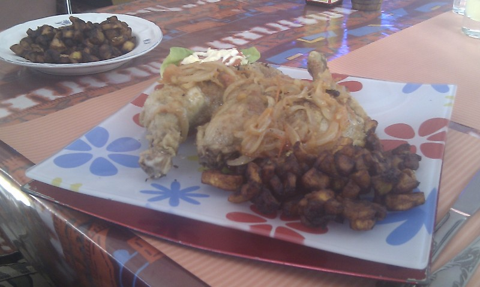

Ce weekend, quelque part, dans un restaurant/bistrot/bar/bouiboui (cochez la(les) mentions inutiles) africain de Bruxelles, 3 amis vont participer à une expérience interdite. Survivre dans un _nganda_ camerounais :) .

L'établissement n'a pas de nom mais semble ouvert, il est 16h00 et il fait chaud on pénètre dans la salle toute de rose décorée tenue par une camerounaise qui nous invite à nous assoir, l'expérience peut commencer:

La serveuse quitte son bar pour nous donner la carte et repart en nous laissant contempler le menu. Après beaucoup de réflexions _Client3_ la rappelle.

**Client1**: Je vais prendre [une sauce graine](http://www.youtube.com/watch?v=jPmjYx2HAJc "Recette sur youtube") **Client2**: Moi je vais prendre un Bœuf pistache. **Serveuse**: Votre bœuf sera accompagné de quoi? **Client2**: du riz s'il vous plait **Client3**: Et moi je prendrais un _Aloko_ poulet braisé La serveuse repart sans avoir entendu notre commande de boisson ...

Deux minutes plus tard elle revient... **Serveuse**: "pardon y'a pas de sauce graine" **Client1**: Okay.... je vais prendre alors le Folon arachide La serveuse repart.

Deux minutes plus tard la serveuse revient... **Serveuse**: "Y'a pas d'arachide ... et y'a pas de Folon" **Client1**: "Mais c'est dans votre menu, bon dieu, qu'est-ce que vous avez ce sera plus simple!" Après beaucoup de palabres entre _Client1_ et la serveuse. **Client1**: "Je prendrais une simple assiette d'Aloko." **Client1**: "On peut demander la boisson" **Client 3**: "On va prendre 3 Ice Tea s'il vous plait" La serveuse repart et revient une minute plus tard **Serveuse**: Y'a pas d'Ice Tea **Client3**: commence à rire tellement la situation est grotesque. **Client2**: on va prendre 2 Sprites **Client1**: je prends rien c'est n'importe quoi **Serveuse**: Y'a pas de Sprite aussi **Client2**: Qu'est-ce que vous avez alors ? **Serveuse**: On a du Fanta ... je crois La serveuse s'en va

Elle revient avec 2 Fanta 2 minutes plus tard.

25 minutes plus tard, la serveuses arrivent avec les plats: Client3 recoit le premier sa commande, Client1 recoit son "assiette d'Aloko" et Client2 recoit une assiette de bœuf à la sauce tomate accompagné de riz. **Client2** : "heu madame, j'avais demandé un Bœuf pistache... il est où ?" **Serveuse**: Ah oui c'est vrai... désolé

Toute ressemblance à une histoire vécu ce weekend du côté d'un _nganda_ camerounais de Bruxelles est totalement fortuite est volontaire

_**Le plat à l'Aloko ivoirien remixé par la cuisinière camerounaise**_ 

_PS1: Aloko = [Banane Plantain](http://fr.wikipedia.org/wiki/Banane_plantain) (race de banane que l'on peut frire comme des pommes de terres) PS2: Folon = [Feuille d'Amaranthe](http://fr.wikipedia.org/wiki/Amarante_%28plante%29)_
